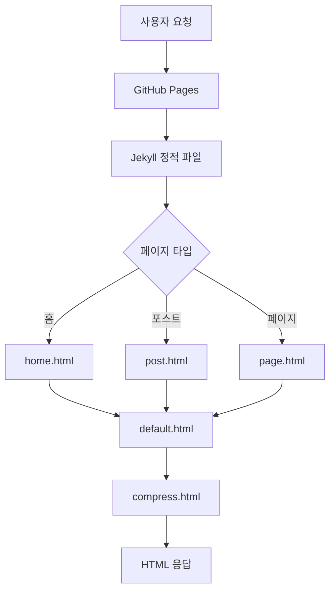
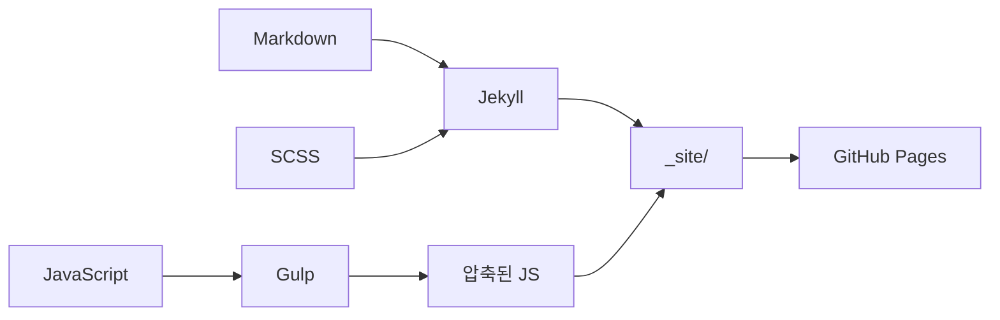

# Architecture Documentation

이 문서는 naksupapa.github.io Jekyll 블로그의 전체 아키텍처를 설명합니다.

---

## 기술 스택

| 구분 | 기술 |
|------|------|
| **호스팅** | GitHub Pages |
| **정적 사이트 생성기** | Jekyll 4.x |
| **테마** | jekyll-theme-chirpy v4.3.4+ |
| **템플릿 엔진** | Liquid |
| **마크업** | Markdown (kramdown) |
| **스타일링** | SASS/SCSS |
| **JavaScript** | Vanilla JS + Gulp 빌드 |
| **코드 하이라이팅** | Rouge |
| **CDN** | jsDelivr (Bootstrap, Font Awesome, jQuery) |
| **댓글** | Utteranc.es (GitHub Issues 기반) |
| **분석** | Google Analytics |
| **다이어그램** | Mermaid.js |
| **CI/CD** | GitHub Actions |
| **테스트** | html-proofer |

---

## 디렉토리 구조

```
naksupapa.github.io/
├── _config.yml                 # Jekyll 메인 설정
├── _posts/                     # 발행된 블로그 포스트
├── _drafts/                    # 초안 (미발행)
├── _tabs/                      # 네비게이션 페이지
├── _data/                      # YAML 데이터 및 다국어 파일
├── _layouts/                   # 페이지 레이아웃 템플릿
├── _includes/                  # 재사용 가능한 템플릿 컴포넌트
├── _sass/                      # SCSS 스타일시트
├── _javascript/                # JavaScript 소스 파일
├── _plugins/                   # 커스텀 Ruby 플러그인
├── assets/                     # 정적 자원 (CSS, JS, 이미지)
├── tools/                      # 배포 스크립트
├── .github/workflows/          # GitHub Actions CI/CD
├── Gemfile                     # Ruby 의존성
├── gulpfile.js/                # JavaScript 빌드 설정
└── index.html                  # 홈페이지 진입점
```

---

## 핵심 설정 (_config.yml)

### 사이트 기본 정보
- **제목**: naksupapa blog
- **태그라인**: I'm a game server developer
- **URL**: https://naksupapa.github.io
- **타임존**: Asia/Seoul
- **언어**: 영어 (기본), 다국어 지원

### 테마 설정
- **모드**: 다크 모드 (기본값, 토글 가능)
- **아바타**: /assets/img/avatar.jpg
- **TOC**: 포스트에 자동 생성

### 콘텐츠 설정
- **Permalink**: `/posts/:title/`
- **페이지네이션**: 10개 포스트/페이지
- **구문 강조**: Rouge (줄 번호 포함)

---

## 레이아웃 시스템

### 레이아웃 계층 구조

```
compress.html (최상위 - HTML 압축)
    ↓
default.html (기본 구조)
    ├── home.html      (홈페이지)
    ├── post.html      (블로그 포스트)
    ├── page.html      (일반 페이지)
    ├── archives.html  (아카이브)
    ├── categories.html (카테고리 목록)
    ├── category.html  (단일 카테고리)
    ├── tags.html      (태그 목록)
    └── tag.html       (단일 태그)
```

### 주요 레이아웃 설명

| 레이아웃 | 용도 |
|---------|------|
| `default.html` | 사이드바, 탑바, 메인 래퍼 포함한 기본 구조 |
| `page.html` | 2컬럼 레이아웃 (본문 + 우측 패널) |
| `post.html` | 메타정보, 댓글, 관련 포스트 포함 |
| `home.html` | 포스트 목록, 고정글, 페이지네이션 |
| `compress.html` | 프로덕션 HTML 압축 |

---

## 컴포넌트 시스템 (_includes/)

### 레이아웃 컴포넌트
| 파일 | 기능 |
|------|------|
| `head.html` | 메타태그, 폰트, CDN, GA 설정 |
| `sidebar.html` | 좌측 사이드바 (아바타, 네비게이션) |
| `topbar.html` | 상단 네비게이션 (브레드크럼, 검색) |
| `footer.html` | 푸터 |
| `mode-toggle.html` | 다크/라이트 모드 토글 |

### 포스트 컴포넌트
| 파일 | 기능 |
|------|------|
| `post-nav.html` | 이전/다음 포스트 네비게이션 |
| `post-sharing.html` | 소셜 공유 버튼 |
| `toc.html` | 목차 |
| `read-time.html` | 예상 읽기 시간 |
| `timeago.html` | 상대적 시간 표시 |
| `related-posts.html` | 관련 포스트 |

### 유틸리티 컴포넌트
| 파일 | 기능 |
|------|------|
| `search-loader.html` | 검색 기능 |
| `mermaid.html` | 다이어그램 지원 |
| `google-analytics.html` | GA 스크립트 |
| `js-selector.html` | 레이아웃별 JS 동적 로드 |

---

## JavaScript 빌드 파이프라인

### 빌드 시스템
- **도구**: Gulp 4.x
- **소스**: `_javascript/`
- **출력**: `assets/js/dist/` (압축된 번들)

### 소스 구조

```
_javascript/
├── commons/                    # 공통 유틸리티
│   ├── back-to-top.js         # 맨 위로 스크롤
│   ├── mode-toggle.js         # 테마 토글
│   ├── search-display.js      # 검색 기능
│   ├── sidebar.js             # 모바일 사이드바
│   ├── tooltip-loader.js      # 툴팁
│   ├── topbar-switch.js       # 탑바 가시성
│   └── topbar-title.js        # 동적 탑바 제목
│
├── utils/                      # 페이지별 유틸리티
│   ├── category-collapse.js   # 카테고리 아코디언
│   ├── checkbox.js            # 체크박스 인터랙션
│   ├── clipboard.js           # 코드 복사
│   ├── img-extra.js           # 이미지 줌
│   ├── pageviews.js           # 페이지뷰 추적
│   ├── smooth-scroll.js       # 부드러운 스크롤
│   └── timeago.js             # 상대 시간
│
└── copyright                   # 라이선스 헤더
```

### 생성되는 번들

| 번들 | 포함 내용 | 사용처 |
|------|----------|--------|
| `commons.min.js` | 공통 유틸리티 | 모든 페이지 |
| `home.min.js` | commons + timeago | 홈페이지 |
| `post.min.js` | commons + utils | 포스트 페이지 |
| `categories.min.js` | 카테고리 기능 | 카테고리 페이지 |
| `page.min.js` | 페이지 기능 | 일반 페이지 |
| `pvreport.min.js` | 페이지뷰 리포트 | Analytics |

### 빌드 명령어

```bash
npx gulp          # 프로덕션 빌드 (압축)
npx gulp dev      # 개발 모드 (Watch)
```

---

## SASS/SCSS 구조

### 파일 구조

```
_sass/
├── jekyll-theme-chirpy.scss   # 메인 진입점
├── variables-hook.scss        # 커스터마이징 훅
├── addon/
│   ├── commons.scss           # 공통 컴포넌트 스타일
│   ├── module.scss            # 모듈 스타일
│   ├── syntax.scss            # 코드 하이라이팅
│   └── variables.scss         # 테마 변수
├── colors/
│   ├── dark-syntax.scss       # 다크 테마 구문 색상
│   ├── dark-typography.scss   # 다크 테마 타이포그래피
│   ├── light-syntax.scss      # 라이트 테마 구문 색상
│   └── light-typography.scss  # 라이트 테마 타이포그래피
└── layout/
    ├── home.scss              # 홈페이지
    ├── post.scss              # 포스트
    ├── tags.scss              # 태그
    ├── archives.scss          # 아카이브
    ├── categories.scss        # 카테고리
    └── category-tag.scss      # 공통 스타일
```

### 커스터마이징

`_sass/variables-hook.scss`에서 테마 변수를 오버라이드할 수 있습니다.

---

## 콘텐츠 구조

### 포스트 (_posts/)

**파일명 규칙**: `YYYY-MM-DD-title.md`

**Front Matter 예시**:
```yaml
---
title: 포스트 제목
author: naksupapa
date: 2023-04-13 00:00:00 +0900
categories: [카테고리]
tags: [태그1, 태그2]
mermaid: true              # 다이어그램 사용 시
pin: true                  # 고정글 설정 시
---
```

### 탭 페이지 (_tabs/)

| 파일 | 용도 |
|------|------|
| `about.md` | 소개 페이지 |
| `archives.md` | 포스트 아카이브 |
| `categories.md` | 카테고리 목록 |
| `tags.md` | 태그 목록 |

### 데이터 파일 (_data/)

| 파일 | 용도 |
|------|------|
| `contact.yml` | 소셜 연락처 아이콘 |
| `share.yml` | 공유 플랫폼 설정 |
| `locales/*.yml` | 다국어 번역 (en, ko, zh-CN, id-ID) |

---

## 플러그인

### posts-lastmod-hook.rb

Git 히스토리를 기반으로 포스트 수정일을 자동 설정합니다.

```ruby
Jekyll::Hooks.register :posts, :post_init do |post|
  commit_num = `git rev-list --count HEAD "#{ post.path }"`

  if commit_num.to_i > 1
    lastmod_date = `git log -1 --pretty="%ad" --date=iso "#{ post.path }"`
    post.data['last_modified_at'] = lastmod_date
  end
end
```

**동작**: 포스트가 1번 이상 커밋된 경우, 마지막 수정일을 `last_modified_at`으로 설정

---

## 배포 워크플로우

### GitHub Actions (자동 배포)

**파일**: `.github/workflows/pages-deploy.yml`

**트리거**:
- main/master 브랜치 push
- 수동 실행 (Actions 탭)

**워크플로우**:

```
1. Checkout (전체 git 히스토리)
       ↓
2. Ruby 설정 (3.x + bundler 캐싱)
       ↓
3. Jekyll 빌드
   JEKYLL_ENV=production bundle exec jekyll b
       ↓
4. HTML 테스트
   bundle exec htmlproofer _site
       ↓
5. GitHub Pages 배포
```

### 수동 배포 스크립트

```bash
# 빌드, 테스트, 배포
bash ./tools/deploy.sh

# 테스트만 (배포 안 함)
bash ./tools/deploy.sh --dry-run
```

---

## 개발 명령어

### 로컬 개발

```bash
# Ruby 의존성 설치
bundle

# 개발 서버 시작 (http://localhost:4000)
bundle exec jekyll serve

# JavaScript 감시 모드
npx gulp dev
```

### 프로덕션 빌드

```bash
# Jekyll 빌드
bundle exec jekyll b

# 프로덕션 빌드 (환경변수 설정)
JEKYLL_ENV=production bundle exec jekyll b

# JavaScript 압축 빌드
npx gulp
```

### 테스트

```bash
bundle exec htmlproofer _site \
  --disable-external \
  --check-html \
  --allow_hash_href
```

---

## 주요 기능

| 기능 | 설명 |
|------|------|
| **다크 모드** | 기본값, 토글 가능 |
| **다국어** | 4개 언어 지원 |
| **SEO** | jekyll-seo-tag 플러그인 |
| **반응형** | Bootstrap 4 그리드 |
| **검색** | 클라이언트 사이드 검색 |
| **댓글** | Utteranc.es (GitHub Issues) |
| **TOC** | 자동 생성 목차 |
| **관련 포스트** | 사이드바 컴포넌트 |
| **페이지네이션** | 10개/페이지 |
| **고정글** | pin 속성으로 상단 고정 |
| **읽기 시간** | 자동 계산 |
| **코드 복사** | 클립보드 버튼 |
| **이미지 줌** | Lightbox |
| **Mermaid** | 플로우차트, UML 등 |

---

## 파일 통계

| 구분 | 개수 |
|------|------|
| 레이아웃 | 10개 |
| 인클루드 컴포넌트 | 27개 |
| JavaScript 소스 | 14개 |
| JavaScript 번들 | 6개 |
| SCSS 파일 | 16개 |
| 다국어 파일 | 4개 |
| 발행 포스트 | 9개 |
| 초안 | 7개 |
| 플러그인 | 1개 |

---

## 다이어그램

### 요청 흐름



### 빌드 파이프라인



---

*이 문서는 2024년 기준으로 작성되었습니다.*
