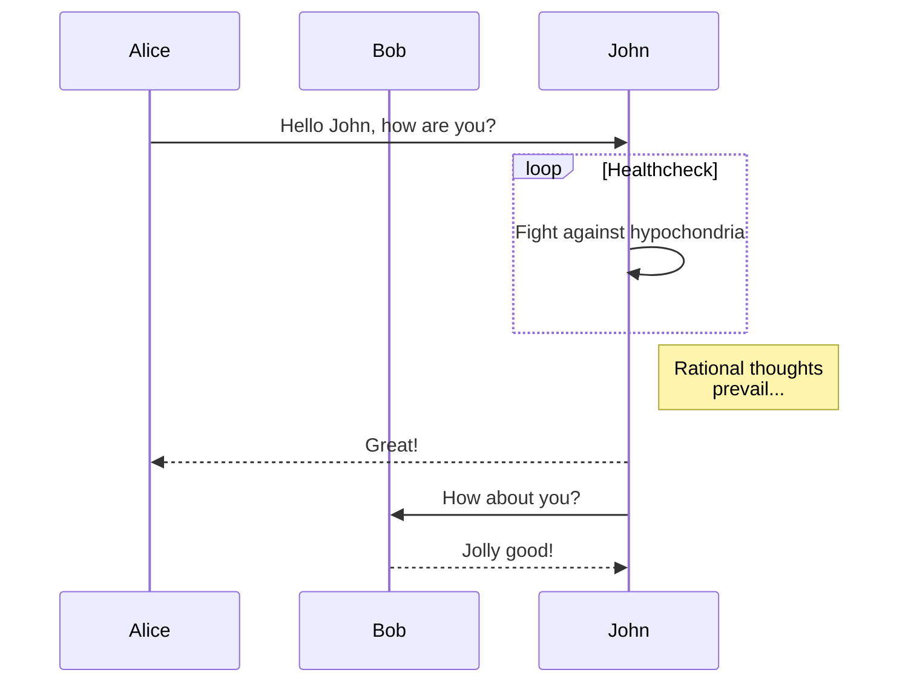
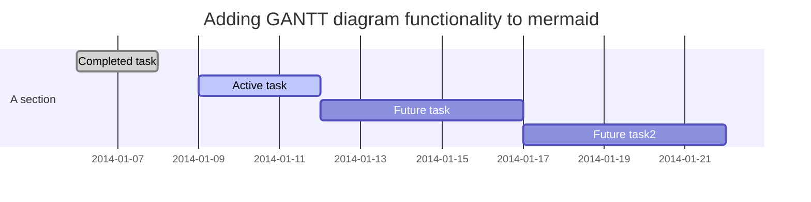

Person: 
- markdown mermaid 예제 알려줘

ChatGPT: 
- Mermaid은 Markdown을 사용하여 다이어그램, 시퀀스 다이어그램, Gantt 차트 등 다양한 그래프를 그리는 라이브러리입니다. 아래는 Mermaid을 사용한 예제입니다.

시퀀스 다이어그램 예제:

```rust




```

플로우차트 예제:
```


```

Gantt 차트 예제:
```





```less

더 많은 Mermaid 예제는 [Mermaid 공식 웹사이트](https://mermaid-js.github.io/mermaid/#/)에서 확인할 수 있습니다.
```
